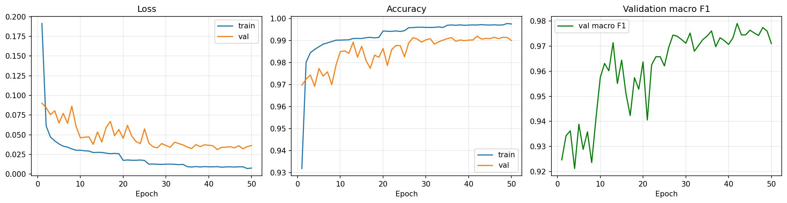
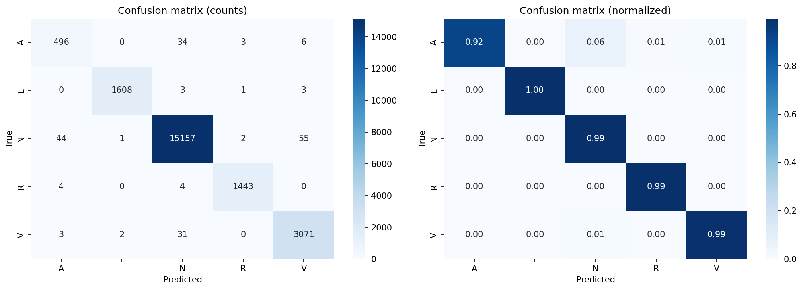
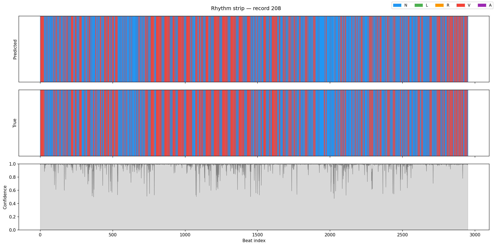

# ECG Arrhythmia Detection — End-to-End MLOps Pipeline

     

An end-to-end MLOps pipeline that detects cardiac arrhythmias from ECG signals 
using a CNN-BiLSTM architecture with an attention mechanism. Achieves **99% accuracy 
and 0.98 macro F1** across 5 arrhythmia classes on the MIT-BIH Arrhythmia Database.

**Live Demo** → [HuggingFace Spaces](#) *(link to be added after deployment)*  
**Model Weights** → [HuggingFace Hub](https://huggingface.co/dheerajthuvara/ecg-arrhythmia-detection)

---

## Problem Statement

Cardiac arrhythmias affect millions of people worldwide and are a leading cause of sudden cardiac death. Manual ECG interpretation by cardiologists is time-consuming and not scalable for continuous monitoring. This project builds an automated, production-grade pipeline that classifies ECG beats into five rhythm classes in real time.

---

## Pipeline Architecture

```
MIT-BIH Dataset → Signal Preprocessing → DVC Versioning
      ↓
CNN-BiLSTM Model → MLflow Tracking → Model Registry
      ↓
Docker Container → FastAPI Service → Gradio Demo
      ↓
GitHub Actions CI/CD + Evidently Drift Monitoring
```

---

## Model Architecture

The model combines a CNN feature extractor with a BiLSTM sequence model and an attention head:

- **CNN blocks** (3 layers: 32 → 64 → 128 filters) extract local morphological features from the raw waveform — QRS complex shape, P-wave patterns
- **BiLSTM** (2 layers, 128 hidden units, bidirectional) captures temporal dependencies across the beat sequence
- **Attention mechanism** learns which timesteps are most discriminative for classification
- **Classification head** (Linear → ReLU → Dropout → Linear) maps to 5 output classes

```
Input (1, 180) → CNN × 3 → BiLSTM × 2 → Attention → FC → 5 classes
```

---

## Dataset

**MIT-BIH Arrhythmia Database** — PhysioNet  
48 half-hour ECG recordings, 360 Hz sampling rate, ~100,000 annotated beats

| Class | Description | Label |
|---|---|---|
| N | Normal sinus rhythm | N |
| L | Left bundle branch block | L |
| R | Right bundle branch block | R |
| V | Premature ventricular contraction | V |
| A | Atrial premature contraction | A |

Class imbalance is handled with **SMOTE** oversampling on the training split only (no leakage).

---

## Results

| Class | Precision | Recall | F1 |
|---|---|---|---|
| A — APC | 0.91 | 0.92 | 0.91 |
| L — LBBB | 1.00 | 1.00 | 1.00 |
| N — Normal | 1.00 | 0.99 | 0.99 |
| R — RBBB | 1.00 | 0.99 | 1.00 |
| V — PVC | 0.98 | 0.99 | 0.98 |
| **Macro avg** | **0.98** | **0.98** | **0.98** |
| **Weighted avg** | **0.99** | **0.99** | **0.99** |

**Test set size:** 21,971 beats · **Overall accuracy:** 99%


### Training curves


### Confusion matrix


### Rhythm strip visualization


---

## MLOps Stack

| Component | Tool | Purpose |
|---|---|---|
| Data versioning | DVC + Google Drive | Version raw and processed datasets |
| Experiment tracking | MLflow | Log params, metrics, model artifacts per run |
| Containerization | Docker | Reproducible inference environment |
| Inference API | FastAPI | REST endpoint for beat classification |
| Demo UI | Gradio | Interactive ECG upload and visualization |
| CI/CD | GitHub Actions | Test, build, and verify on every push |
| Drift monitoring | Evidently AI | Detect signal distribution shift in production |

---

## Project Structure

```
ecg-arrhythmia/
├── data/
│   ├── raw/                  # MIT-BIH .dat/.hea files (DVC tracked)
│   └── processed/            # Segmented beat arrays (DVC tracked)
├── models/
│   ├── best_model.pt         # Trained model weights (DVC tracked)
│   ├── label_encoder.pkl     # Class label mapping
│   └── model_config.json     # Architecture hyperparameters
├── notebooks/
│   └── ecg_arrhythmia_detection.ipynb
├── app/
│   ├── main.py               # FastAPI inference service
│   ├── gradio_app.py         # Gradio demo UI
│   ├── Dockerfile
│   └── requirements.txt
├── reports/
│   └── figures/              # Training plots, confusion matrix
├── .dvc/                     # DVC configuration
├── .github/workflows/        # CI/CD pipeline
└── README.md
```

---

## Quickstart

### 1. Clone and pull data
### 1. Clone the repo

```bash
git clone https://github.com/dheerajthuvara/ecg-arrhythmia-detection.git
cd ecg-arrhythmia-detection
```

Raw data downloads automatically when you run cell 4 of the notebook via `wfdb`.  
Processed data is available on [HuggingFace](https://huggingface.co/dheerajthuvara/ecg-arrhythmia-detection).

### 2. Set up environment and run notebook

```bash
python3 -m venv venv-training
source venv-training/bin/activate
pip install torch wfdb mlflow imbalanced-learn scikit-learn scipy seaborn jupyter
jupyter notebook notebooks/ecg_arrhythmia_detection.ipynb
```

### 3. Run inference service locally

```bash
cd app
python3 -m venv venv-app
source venv-app/bin/activate
pip install -r requirements.txt
uvicorn main:app --reload
```

### 4. Run with Docker

```bash
docker build -t ecg-arrhythmia ./app
docker run -p 8000:8000 ecg-arrhythmia
```

### 5. API usage

```bash
curl -X POST "http://localhost:8000/predict" \
  -H "Content-Type: application/json" \
  -d '{"signal": [0.1, 0.2, ...]}'
```

Response:
```json
{
  "predicted_class": "N",
  "confidence": 0.97,
  "probabilities": {"N": 0.97, "L": 0.01, "R": 0.01, "V": 0.005, "A": 0.005}
}
```

---

## MLflow Experiment Tracking

To view experiment runs locally:

```bash
mlflow ui --backend-store-uri file:./mlruns
```

Open `http://localhost:5000` to compare runs, metrics, and artifacts.

---

## Reproducing from Scratch

```bash
# 1. pull raw data
dvc pull data/raw

# 2. run the training notebook end to end
jupyter nbconvert --to notebook --execute notebooks/ecg_arrhythmia_detection.ipynb

# 3. push new artifacts
dvc add data/processed models/best_model.pt
dvc push
```

---

## Background

This project extends work done during my role as ML Engineer at Apnimed, where I built a CNN-BiLSTM architecture for sleep stage classification on PPG data. The same architecture family — local feature extraction via CNN followed by temporal modeling via BiLSTM — transfers naturally to ECG arrhythmia detection, a different biomedical time-series classification problem.

---

## License

MIT License. Dataset is from PhysioNet MIT-BIH Arrhythmia Database — see [PhysioNet license](https://physionet.org/content/mitdb/1.0.0/).

---

## Author

**Dheeraj Thuvara** — Software & AI Engineer  
[LinkedIn](#) · [Portfolio](https://dtlabs.me) · [GitHub](https://github.com/unnit) · [HuggingFace](https://huggingface.co/dheerajthuvara)
